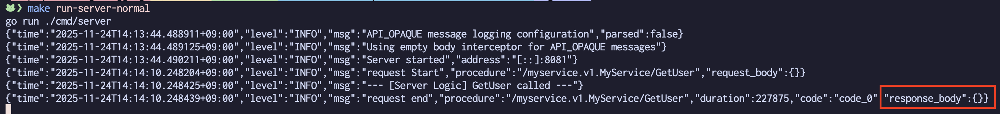
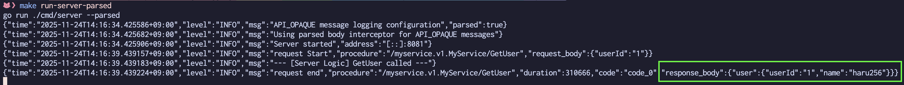

# 記事: API_OPAQUE のmessageのロギング のサンプルコード

記事: [API_OPAQUE のmessageのロギング](https://zenn.dev/haru256/articles/7c7317e9cdd96d) のサンプルコードリポジトリです。

このリポジトリには、以下のすべてが含まれています：

* API_OPAQUE メッセージを使用したProtobuf定義
* API_OPAQUE メッセージのロギングを行うConnectインターセプタ

実際に動作を確認することで、記事の内容をより深く理解できます。

## 動作確認手順

### 事前準備

```bash
mise install
```

### API_OPAQUE の対応なしの場合

```bash
# サーバーの起動
make run-server-normal

# 別のターミナルで各RPCを実行
make get-user
```

実行結果: API_OPAQUEによりフィールドが非公開となっているため、ペイロードが表示されない



### API_OPAQUE の対応ありの場合

```bash
# サーバーの起動
make run-server-parsed

# 別のターミナルで各RPCを実行
make get-user
```

実行結果: API_OPAQUEによりフィールドが非公開となっているが、 protojsonでmessageを適切にjsonに変換しているため、ペイロードが表示される


